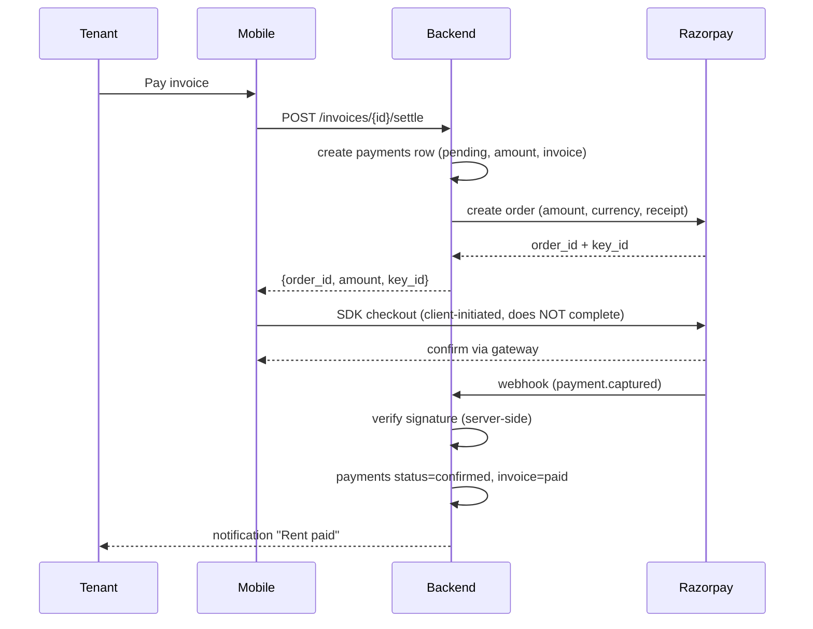

# Nestro API Specification

REST over HTTPS, served by the FastAPI backend.

## Conventions

- Base path: `/api/v1`.
- JSON in/out; every request and response validated by Pydantic.
- Error shape: `{"detail": "..."}`. `401` = missing/invalid token, `403` = authenticated but not allowed, `404` = missing or not in your scope, `409` = conflict, `422` = validation.
- Pagination: `?limit` (default 20, max 100) + `?offset`; list responses use the envelope `{"items": [...], "total", "limit", "offset"}`.
- Resource names are plural and nouns where natural; sub-resources nest under their owner: `/pgs/{pg_id}/rooms/{room_id}/beds`.

Scope note: `pg.scoped_ids` in the token are a fast-lookup cache only; every endpoint re-reads PG membership from the DB (see SECURITY.md).

- Money: serialized as **string** (no float precision drift).
- Timestamps: ISO-8601 UTC (`TIMESTAMPTZ`).
- Authorization header: `Authorization: Bearer <JWT>` on every protected endpoint.
- Roles referenced below: `SUPER_ADMIN`, `PG_OWNER`, `MANAGER`, `STAFF`, `TENANT`. "member" = authenticated user with membership in that PG. For scope rules see `AUTHENTICATION_SPEC.md` and `SECURITY.md`.

## 1. Authentication

<!--- Authentication is owned by Supabase Auth (GoTrue). The backend consumes tokens only; see AUTHENTICATION_SPEC.md for register/login/OTP/reset flows and session handling. The backend exposes only token-based endpoints to support the client apps. -->

| #   | Method | Path            | Request                   | Response                         | Authorization |
| --- | ------ | --------------- | ------------------------- | -------------------------------- | ------------- |
| 1   | POST   | `/auth/onboard` | `{user_id, role, pg_id?}` | `201` created                    | Valid JWT     |
| 2   | GET    | `/auth/me`      | --                        | `200` current user + memberships | Valid JWT     |

**Notes**

- Onboard (1): after Supabase Auth returns, the backend creates/links the `users` profile, sets role (from the JWT claims + DB, never from the client), and for tenants creates the `tenants` row + first `tenant_stays` if a `pg_id` is supplied. Idempotent per `user_id` — calling again with the same identity resolves to the existing row (`200`).
- Me (2): resolves the JWT to `{user, role, memberships: [pg_id...], tenant_id?}`. Client apps call it once at startup to hydrate identity and role.

## 2. Users

| #   | Method | Path                     | Request                               | Response                   | Authorization |
| --- | ------ | ------------------------ | ------------------------------------- | -------------------------- | ------------- |
| 3   | GET    | `/users`                 | `?limit=&offset=&search=`             | `200` paginated list       | `SUPER_ADMIN` |
| 4   | GET    | `/users/{id}`            | --                                    | `200` user                 | `SUPER_ADMIN` |
| 5   | POST   | `/users`                 | `{email?, phone, name, role}`         | `201` created              | `SUPER_ADMIN` |
| 6   | PATCH  | `/users/{id}`            | `{name?, phone?, email?, is_active?}` | `200` updated              | `SUPER_ADMIN` |
| 7   | POST   | `/users/{id}/deactivate` | --                                    | `200` `{is_active: false}` | `SUPER_ADMIN` |
| 8   | POST   | `/users/{id}/reactivate` | --                                    | `200` `{is_active: true}`  | `SUPER_ADMIN` |

**Notes**

- Deactivate (7) is a soft delete: sets `is_active = false`, revokes active Supabase sessions, and blocks transport, while preserving history/invoices/complaints. `reactivate` (8) reverses it.
- Users are created after Supabase Auth holds the credential — the backend never holds passwords (see AUTHENTICATION_SPEC).
- Role changes on an existing user are done by a `SUPER_ADMIN` via a dedicated endpoint (see 6) to keep an audit trail, not via generic PATCH (6).

## 3. PGs (Paying Guest houses)

| #   | Method | Path                             | Request                                         | Response                   | Authorization                          |
| --- | ------ | -------------------------------- | ----------------------------------------------- | -------------------------- | -------------------------------------- |
| 9   | GET    | `/pgs`                           | `?limit=&offset=&status=`                       | `200` paginated list       | member                                 |
| 10  | POST   | `/pgs`                           | `{name, address, type, facilities[], rules?}`   | `201`                      | `PG_OWNER`                             |
| 11  | GET    | `/pgs/{pg_id}`                   | --                                              | `200` PG                   | member                                 |
| 12  | PATCH  | `/pgs/{pg_id}`                   | `{name?, address?, type?, facilities?, rules?}` | `200`                      | `PG_OWNER` (own), `MANAGER` (assigned) |
| 13  | POST   | `/pgs/{pg_id}/archive`           | --                                              | `200` `{status: "closed"}` | `PG_OWNER` (own)                       |
| 14  | POST   | `/pgs/{pg_id}/members`           | `{user_id, role}` (manager/staff only)          | `201`                      | `PG_OWNER` (own)                       |
| 15  | DELETE | `/pgs/{pg_id}/members/{user_id}` | --                                              | `204`                      | `PG_OWNER` (own)                       |

**Notes**

- GET `/pgs` (9) returns only PGs the caller owns or is a member of — never an unscoped global list.
- Archive (13) is terminal: sets `status='closed'`, prevents new tenants/rent plans; history preserved.
- Membership (14): `PG_OWNER` can assign `MANAGER`/`STAFF` to their own PGs; role must be lower than the grantor's. All member endpoints enforce PG membership from the DB.

## 4. Buildings

| #   | Method | Path                           | Request             | Response       | Authorization                          |
| --- | ------ | ------------------------------ | ------------------- | -------------- | -------------------------------------- |
| 16  | GET    | `/pgs/{pg_id}/buildings`       | `?limit=&offset=`   | `200` list     | member                                 |
| 17  | POST   | `/pgs/{pg_id}/buildings`       | `{name, address?}`  | `201`          | `PG_OWNER` (own), `MANAGER` (assigned) |
| 18  | GET    | `/pgs/{pg_id}/buildings/{bid}` | --                  | `200` building | member                                 |
| 19  | PATCH  | `/pgs/{pg_id}/buildings/{bid}` | `{name?, address?}` | `200`          | `PG_OWNER` (own), `MANAGER` (assigned) |
| 20  | DELETE | `/pgs/{pg_id}/buildings/{bid}` | --                  | `204`          | `PG_OWNER` (own), `MANAGER` (assigned) |

**Notes**

- A PG must have at least one building; a building may be deleted only when it has no floors (else `409`).
- Deleting a building removes its floors, rooms, beds; see cascade rules in `DATABASE.md`. Because beds may hold tenant history, `DELETE` is restricted to buildings with no **occupied** beds.

## 5. Floors

| #   | Method | Path                                        | Request            | Response   | Authorization                          |
| --- | ------ | ------------------------------------------- | ------------------ | ---------- | -------------------------------------- |
| 21  | GET    | `/pgs/{pg_id}/buildings/{bid}/floors`       | `?limit=&offset=`  | `200` list | member                                 |
| 22  | POST   | `/pgs/{pg_id}/buildings/{bid}/floors`       | `{number, label?}` | `201`      | `PG_OWNER` (own), `MANAGER` (assigned) |
| 23  | GET    | `/pgs/{pg_id}/buildings/{bid}/floors/{fid}` | --                 | `200`      | member                                 |
| 24  | PATCH  | `/pgs/{pg_id}/buildings/{bid}/floors/{fid}` | `{label?}`         | `200`      | `PG_OWNER` (own), `MANAGER` (assigned) |

**Notes**

- Floors are numeric within a building; `(building_id, number)` is unique.
- Floors cannot be deleted once they contain rooms (archive/merge instead — Phase 3).

## 6. Rooms

| #   | Method | Path                                  | Request                                                | Response          | Authorization                          |
| --- | ------ | ------------------------------------- | ------------------------------------------------------ | ----------------- | -------------------------------------- |
| 25  | GET    | `/pgs/{pg_id}/rooms`                  | `?floor_id=&status=&limit=&offset=`                    | `200` list        | member                                 |
| 26  | POST   | `/pgs/{pg_id}/rooms`                  | `{floor_id, number, room_type, capacity, rent_amount}` | `201`             | `PG_OWNER` (own), `MANAGER` (assigned) |
| 27  | GET    | `/pgs/{pg_id}/rooms/{room_id}`        | --                                                     | `200` room + beds | member                                 |
| 28  | PATCH  | `/pgs/{pg_id}/rooms/{room_id}`        | `{number?, room_type?, capacity?, rent_amount?}`       | `200`             | `PG_OWNER` (own), `MANAGER` (assigned) |
| 29  | POST   | `/pgs/{pg_id}/rooms/{room_id}/status` | `{status}`                                             | `200`             | `PG_OWNER` (own), `MANAGER` (assigned) |

**Notes**

- Creating a room (26) seeds `capacity` beds in `available` status.
- `status` (29): `available | partial | full | unavailable`. Cannot be set below the number of occupied beds (`422`).
- Capacity is never reduced below the current occupied bed count (`409`).
- Deleting rooms is disallowed while occupied; only `MANAGER`/`PG_OWNER` can set `unavailable`, and `deleted_at` used for soft removal (see rent/complaint history retention).

## 7. Beds

| #   | Method | Path                                         | Request                   | Response                   | Authorization                          |
| --- | ------ | -------------------------------------------- | ------------------------- | -------------------------- | -------------------------------------- |
| 30  | GET    | `/pgs/{pg_id}/rooms/{room_id}/beds`          | `?status=&limit=&offset=` | `200` list                 | member                                 |
| 31  | POST   | `/pgs/{pg_id}/rooms/{room_id}/beds`          | `{label?, blocked?}`      | `201`                      | `PG_OWNER` (own), `MANAGER` (assigned) |
| 32  | GET    | `/pgs/{pg_id}/rooms/{room_id}/beds/{bed_id}` | --                        | `200` bed + current tenant | member                                 |
| 33  | PATCH  | `/pgs/{pg_id}/rooms/{room_id}/beds/{bed_id}` | `{label?, blocked?}`      | `200`                      | `PG_OWNER` (own), `MANAGER` (assigned) |

**Notes**

- Bed status is derived from current `tenant_stays` (occupied when an active stay exists); `blocked` is a manual flag that overrides availability.
- A bed cannot be deleted while it has an active stay or history retaining invoices.

## 8. Tenants

| #   | Method | Path                                       | Request                                       | Response                    | Authorization                          |
| --- | ------ | ------------------------------------------ | --------------------------------------------- | --------------------------- | -------------------------------------- |
| 34  | GET    | `/pgs/{pg_id}/tenants`                     | `?status=&search=&limit=&offset=`             | `200` list                  | member                                 |
| 35  | POST   | `/pgs/{pg_id}/tenants`                     | `{user_id?, full_name, phone, email?, pg_id}` | `201`                       | `PG_OWNER` (own), `MANAGER` (assigned) |
| 36  | GET    | `/pgs/{pg_id}/tenants/{tenant_id}`         | --                                            | `200` tenant + current stay | member                                 |
| 37  | PATCH  | `/pgs/{pg_id}/tenants/{tenant_id}`         | `{full_name?, phone?, email?, user_id?}`      | `200`                       | `PG_OWNER` (own), `MANAGER` (assigned) |
| 38  | POST   | `/pgs/{pg_id}/tenants/{tenant_id}/movein`  | `{bed_id, moved_in_at}`                       | `200`                       | `PG_OWNER` (own), `MANAGER` (assigned) |
| 39  | POST   | `/pgs/{pg_id}/tenants/{tenant_id}/moveout` | `{moved_out_at?}`                             | `200`                       | `PG_OWNER` (own), `MANAGER` (assigned) |
| 40  | POST   | `/pgs/{pg_id}/tenants/{tenant_id}/move`    | `{bed_id?, room_id?, moved_in_at?}`           | `200`                       | `PG_OWNER` (own), `MANAGER` (assigned) |

**Notes**

- `movein` (38): active stay must not already exist (else `409`); bed must be `available`/`blocked=false`; creates a `tenant_stays` row.
- `moveout` (39): closes the active stay; frees the bed; auto-closes active rent plan and marks the rent invoice overdue-up-to-date as settled (see Rent plans).
- `move` (40): closes the current active stay at `moved_out_at` and opens a new one at `moved_in_at` (atomic).
- A tenant's active stay is exactly one; a bed holds at most one active stay (unique partial indexes in `DATABASE.md`).

## 9. Rent Plans, Invoices, and Payments

| #   | Method | Path                                                               | Request                                   | Response                  | Authorization                                           |
| --- | ------ | ------------------------------------------------------------------ | ----------------------------------------- | ------------------------- | ------------------------------------------------------- |
| 41  | POST   | `/pgs/{pg_id}/tenants/{tenant_id}/rent-plans`                      | `{amount, cycle, due_day, starts_at?}`    | `201`                     | `PG_OWNER` (own), `MANAGER` (assigned)                  |
| 42  | GET    | `/pgs/{pg_id}/tenants/{tenant_id}/rent-plans`                      | `?limit=&offset=`                         | `200` list                | member                                                  |
| 43  | PATCH  | `/pgs/{pg_id}/tenants/{tenant_id}/rent-plans/{plan_id}`            | `{amount?, cycle?, due_day?, is_active?}` | `200`                     | `PG_OWNER` (own), `MANAGER` (assigned)                  |
| 44  | GET    | `/pgs/{pg_id}/tenants/{tenant_id}/invoices`                        | `?status=&limit=&offset=`                 | `200` list                | tenant (own), member                                    |
| 45  | GET    | `/pgs/{pg_id}/tenants/{tenant_id}/invoices/{invoice_id}`           | --                                        | `200` invoice + payments  | tenant (own), member                                    |
| 46  | POST   | `/pgs/{pg_id}/tenants/{tenant_id}/invoices/{invoice_id}/settle`    | `{payment_method, gateway_ref?}`          | `200`                     | tenant (own)                                            |
| 47  | GET    | `/pgs/{pg_id}/rents`                                               | `?overdue=&limit=&offset=`                | `200` collection overview | member                                                  |
| 48  | POST   | `/pgs/{pg_id}/tenants/{tenant_id}/invoices/{invoice_id}/mark-paid` | `{amount?}`                               | `200`                     | `PG_OWNER` (own), `MANAGER` (assigned) — cash recording |
| 49  | GET    | `/pgs/{pg_id}/tenant/{tenant_id}/payments`                         | `?limit=&offset=`                         | `200` list                | tenant (own), member                                    |

**Rent plan behavior**

- A rent plan generates one invoice per cycle (cron `generate_invoices`), each `NUMERIC`, with `due_day` and `period`.
- `PATCH` (43) `amount`/`cycle`/`due_day` applies to open (issued/unpaid) invoices only; paid invoices are immutable — history is never rewritten (`409`).
- Deactivate plan (43, `is_active=false`) stops generation, does not cancel existing invoices.

**Payment flow (online — Razorpay)**

- The backend **never trusts the client** for payment confirmation; only the verified Razorpay webhook flips `payments.status` to `confirmed` (see `AUTHENTICATION_SPEC` / `SECURITY`).
- Cash recording (48) is the only status change allowed by a manager (with `method=cash`); online payment status change is backend-driven via webhook only.

## 10. Complaints

| #   | Method | Path                                              | Request                               | Response                   | Authorization                                     |
| --- | ------ | ------------------------------------------------- | ------------------------------------- | -------------------------- | ------------------------------------------------- |
| 50  | GET    | `/pgs/{pg_id}/complaints`                         | `?status=&category=&limit=&offset=`   | `200` list                 | member                                            |
| 51  | POST   | `/pgs/{pg_id}/complaints`                         | `{category, description, photo_url?}` | `201`                      | `TENANT` (own PG), `STAFF` (assigned), member     |
| 52  | GET    | `/pgs/{pg_id}/complaints/{complaint_id}`          | --                                    | `200` complaint + comments | member                                            |
| 53  | POST   | `/pgs/{pg_id}/complaints/{complaint_id}/comments` | `{body, is_internal?}`                | `201`                      | `TENANT` (own), member (internal → staff/manager) |
| 54  | PATCH  | `/pgs/{pg_id}/complaints/{complaint_id}`          | `{status?, handled_by?}`              | `200`                      | `PG_OWNER` (own), `MANAGER` (assigned)            |
| 55  | GET    | `/complaints/mine`                                | `?limit=&offset=`                     | `200` list                 | `TENANT`                                          |

**Notes**

- Complaint creation (51): `photo_url` must be a signed Supabase Storage URL validated against the file-upload allow-list (`SECURITY.md`).
- Status transitions: `open → in-progress → resolved → closed`; `resolved` is settable only by the handler. Reopening a `closed` complaint requires `PG_OWNER` and is audited.
- `is_internal=true` (53) comments are invisible to `TENANT`; filtering happens server-side per role, never client-side.
- `GET /complaints/mine` (55) is the scoped path for tenants — they never list another tenant's complaints. The backend enforces "tenant sees own PG only" everywhere.

## 11. Notices

| #   | Method | Path                               | Request                                     | Response   | Authorization                          |
| --- | ------ | ---------------------------------- | ------------------------------------------- | ---------- | -------------------------------------- |
| 56  | GET    | `/pgs/{pg_id}/notices`             | `?limit=&offset=&active=`                   | `200` list | member                                 |
| 57  | POST   | `/pgs/{pg_id}/notices`             | `{title, body, publish_at?, expires_at?}`   | `201`      | `PG_OWNER` (own), `MANAGER` (assigned) |
| 58  | GET    | `/pgs/{pg_id}/notices/{notice_id}` | --                                          | `200`      | member                                 |
| 59  | PATCH  | `/pgs/{pg_id}/notices/{notice_id}` | `{title?, body?, publish_at?, expires_at?}` | `200`      | `PG_OWNER` (own), `MANAGER` (assigned) |
| 60  | DELETE | `/pgs/{pg_id}/notices/{notice_id}` | --                                          | `204`      | `PG_OWNER` (own), `MANAGER` (assigned) |

**Notes**

- Unpublished (`publish_at` in the future) notices are visible to members with write access only (owner/manager) until published.
- Deleting a notice (60) soft-removes it (notification history untouched); residents keep push copies.

## 12. Notifications

Delivered via Firebase Cloud Messaging; the backend stores a per-user inbox row and drives push.

| #   | Method | Path                               | Request                             | Response                      | Authorization              |
| --- | ------ | ---------------------------------- | ----------------------------------- | ----------------------------- | -------------------------- |
| 61  | GET    | `/notifications`                   | `?unread=&category=&limit=&offset=` | `200` list                    | own only                   |
| 62  | GET    | `/notifications/{id}`              | --                                  | `200` single                  | owner of that notification |
| 63  | POST   | `/notifications/read`              | `{ids[]}`                           | `200` `{updated: n}`          | own only                   |
| 64  | POST   | `/notifications/tokens`            | `{token, platform}`                 | `201` device token registered | own                        |
| 65  | DELETE | `/notifications/tokens/{token_id}` | --                                  | `204` unregistered            | own                        |
| 66  | POST   | `/notifications/mute`              | `{category?, mute_until?}`          | `200` preferences             | own                        |

**Notes**

- All notification endpoints operate on the **caller's own** rows only; ids from other users return `404`.
- `tokens` (64): scoped to user; a token is registered once per (user, device); duplicates are `200` idempotent.
- Push is best-effort; on `410` (Unregistered) from FCM the token is auto-removed. In-app inbox is the source of truth.

## 13. AI Assistant

| #   | Method | Path              | Request             | Response        | Authorization                         |
| --- | ------ | ----------------- | ------------------- | --------------- | ------------------------------------- |
| 67  | POST   | `/assistant/chat` | `{message, pg_id?}` | `200` `{reply}` | valid JWT (member of pg_id if tenant) |

**Notes**

- The assistant resolves role + PG scope from the validated token, then invokes the backend's read path (not the DB directly).
- Tenants prompt within their own PG scope; managers/owners across assigned/own scope.
- Rate-limited separately (see `SECURITY.md`); no system prompts accept injection of new instructions from user messages.

## 14. Audit Log (Admin)

| #   | Method | Path                 | Request                                                              | Response                      | Authorization |
| --- | ------ | -------------------- | -------------------------------------------------------------------- | ----------------------------- | ------------- |
| 68  | GET    | `/audit-logs`        | `?actor_id=&action=&resource=&outcome=&since=&until=&limit=&offset=` | `200` paginated               | `SUPER_ADMIN` |
| 69  | POST   | `/audit-logs/export` | `?since=&until=`                                                     | `202` `{job_id}` async export | `SUPER_ADMIN` |

**Notes**

- Read-only: there is no update/delete path for audit logs (append-only; see `SECURITY.md`).
- Export (69) runs server-side and delivers a signed URL when the job completes; never streams logs to a client synchronously.

## Error Reference

| Code | Meaning                                               |
| ---- | ----------------------------------------------------- |
| 400  | Malformed request / invalid state transition          |
| 401  | Missing or invalid token                              |
| 403  | Authenticated but lacking permission                  |
| 404  | Not found, or outside your scope (no existence leak)  |
| 409  | Conflict (immutable history, duplicate active record) |
| 422  | Pydantic validation failure                           |
| 429  | Rate limit exceeded (see SECURITY.md)                 |
| 500  | Unexpected; logged, no internals returned             |

## Status Codes Used

`200 OK` · `201 Created` · `204 No Content` · `400` · `401` · `403` · `404` · `409` · `422` · `429` · `500`
