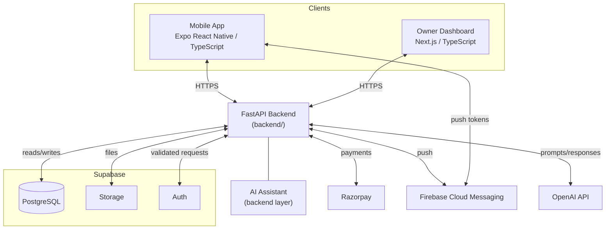
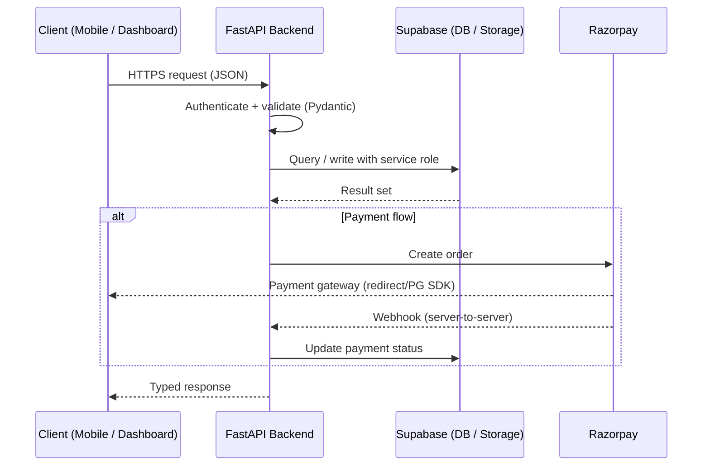
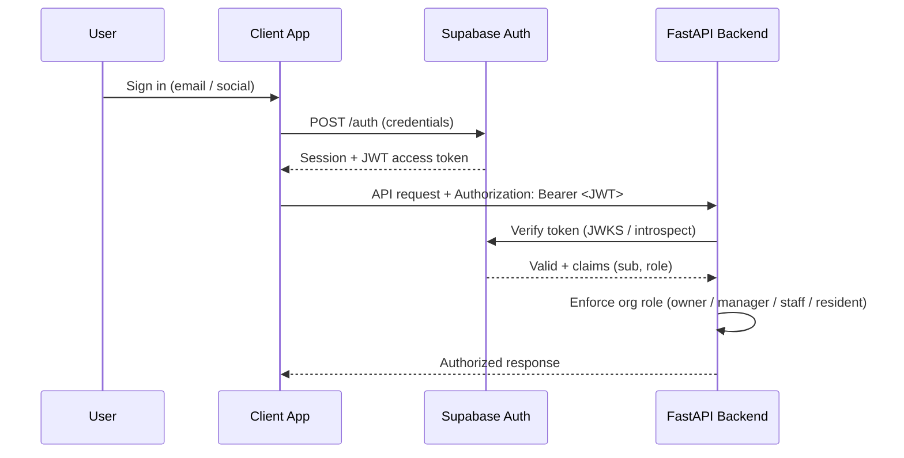
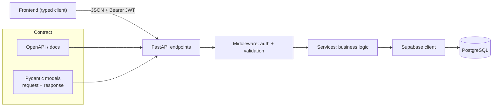
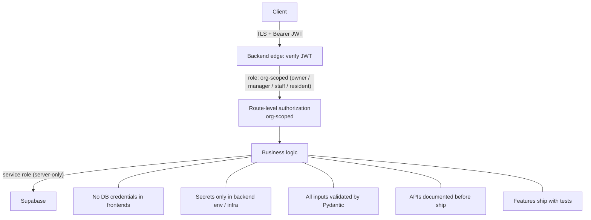

# Nestro Architecture

## Technology Stack

| Layer          | Technology                     | Notes                                                |
| -------------- | ------------------------------ | ---------------------------------------------------- |
| Mobile         | Expo React Native + TypeScript | Resident-facing app (`apps/mobile`)                  |
| Dashboard      | Next.js + TypeScript           | Owner/manager-facing web app (`apps/dashboard`)      |
| Backend        | FastAPI + Python               | REST API and business logic (`backend`)              |
| Database       | Supabase PostgreSQL            | Managed exclusively through the backend              |
| Storage        | Supabase Storage               | User-uploaded files and media                        |
| Authentication | Supabase Auth                  | Auth tokens issued and validated by Supabase         |
| Payments       | Razorpay                       | Rent collection and payments                         |
| Notifications  | Firebase Cloud Messaging       | Push notifications to mobile                         |
| AI             | OpenAI API                     | AI assistant layered on the backend                  |
| Deployment     | Vercel + Railway + Supabase    | Dashboard (Vercel), backend (Railway), DB (Supabase) |

## System Architecture

Clients communicate only with the FastAPI backend. The backend is the single owner of business logic and the only client of the database. Auth lives with Supabase; the backend validates tokens on every request. External services (Razorpay, FCM, OpenAI) are reached only through the backend.

The platform is multi-tenant. `organizations` is the tenant boundary: every business row carries `organization_id`, and the backend scopes every query with `WHERE organization_id = $org`. Organization-level identity and roles come from `organization_members` (owner / manager / staff); a user without a membership row sees nothing in that org. `SUPER_ADMIN` is the only platform-wide role. All business rules and isolation live in the backend, never in the UI.

## Data Flow

All data access routes through the backend: frontends never hold database credentials or issue SQL. Requests come in as Pydantic-validated payloads, business logic runs in the backend, and results are returned as typed responses. Media goes to Supabase Storage via backend-managed signed URLs.

## Authentication Flow

Supabase Auth issues a JWT. The mobile app and dashboard obtain the token from Supabase Auth and attach it to every backend request. The backend verifies each token against Supabase and maps it to the requesting user's organization-membership roles (owner / manager / staff / resident) via a middleware; route-level guards then enforce org-scoped authorization per endpoint. A user with no membership row in an organization sees nothing in it.

## API Communication

The backend exposes a documented REST API. Every request and response is validated by Pydantic. Frontends use generated/typed clients. The API contract (schemas, endpoints) is the boundary between the backend and its consumers, and is kept current in the backend docs (`backend/README.md`).

## Security Model

Security principles:

- **Tenant isolation** — `organizations` is the tenant boundary; a user without an `organization_members` row in an org sees nothing in it.
- **Transport** — all client↔backend traffic over HTTPS with TLS.
- **Authentication** — Supabase Auth JWT verified by the backend on every request.
- **Authorization** — role-based guards on endpoints; business rules never live in the UI.
- **Credential boundaries** — frontends never access the database; only the backend holds database access.
- **Secret management** — keys and tokens exist only in backend environment variables and infrastructure config; never in code, config, or commits.
- **Payment integrity** — Razorpay order status is confirmed server-side via webhooks, never trusted from the client.
- **Validation** — every request and response passes through Pydantic models.
- **AI boundary** — the AI assistant calls the backend's own data services under the same auth and role rules; it never receives database access.
