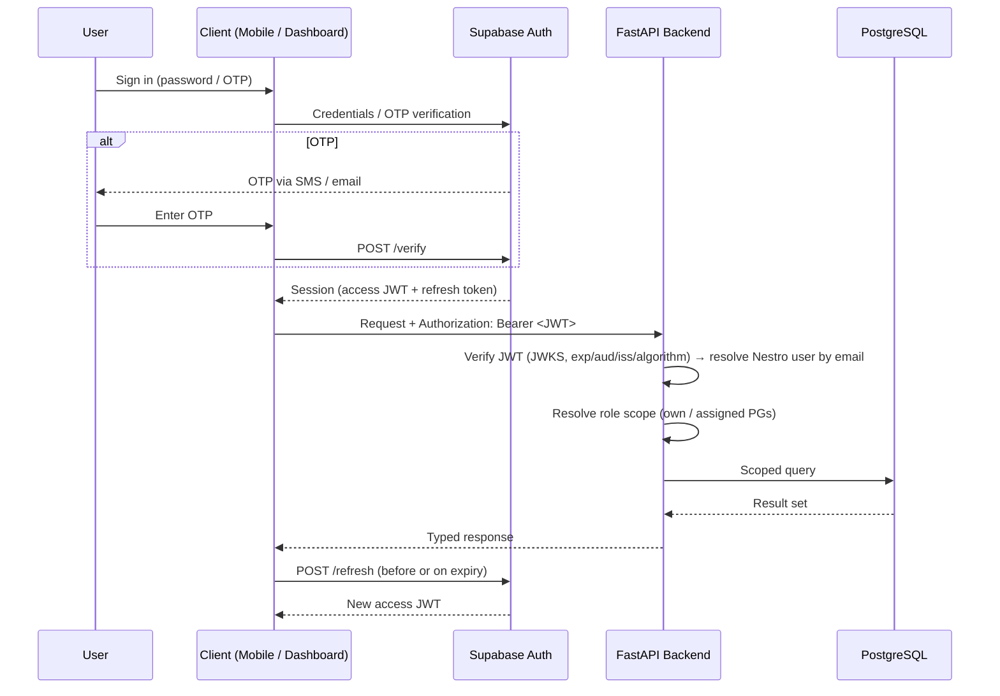
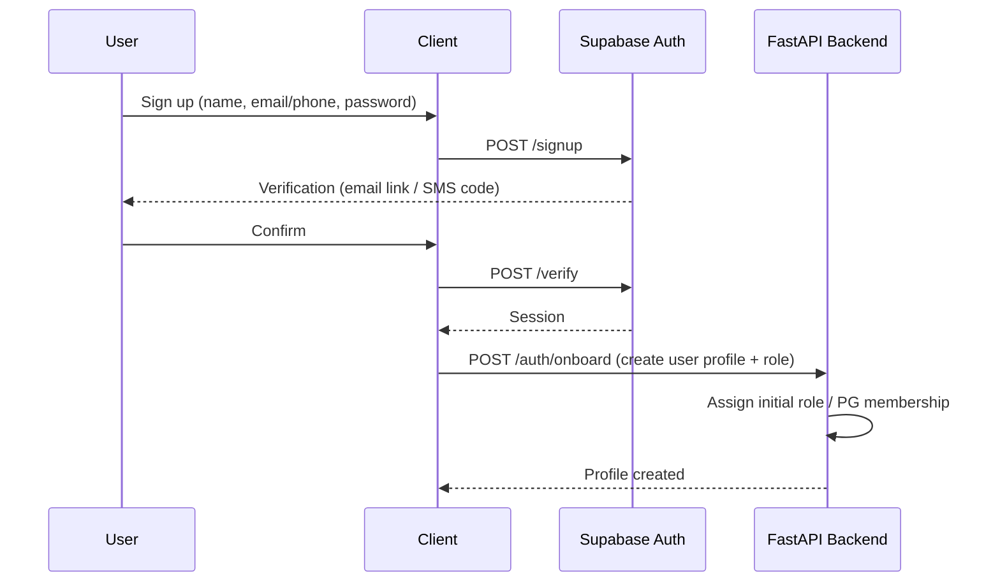
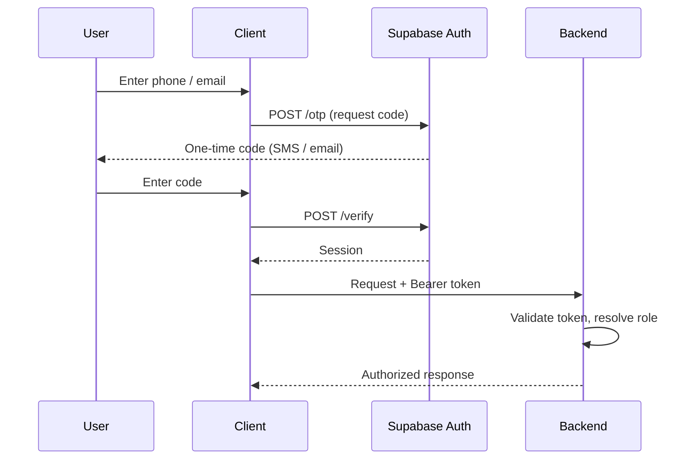
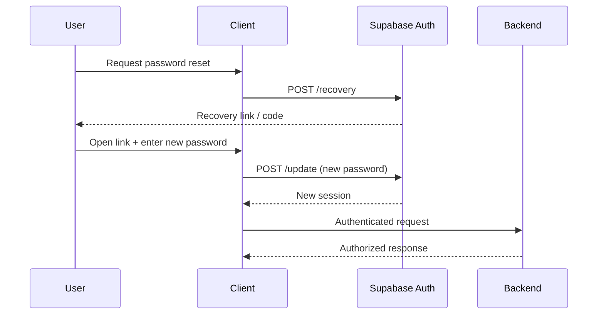

# Nestro Authentication Specification

## Provider

Authentication is handled by **Supabase Auth** (GoTrue). The FastAPI backend validates every issued token on each request. No password, hash, or token is ever stored in the backend or client code.

## Supported Flows

- Register (email/phone)
- Login (email + password)
- OTP Login (SMS/email one-time password)
- Password Reset

## Roles

| Role          | Description                                 |
| ------------- | ------------------------------------------- |
| `SUPER_ADMIN` | Platform-level operator: users, PGs, config |
| `PG_OWNER`    | Owns PGs; configures and manages them       |
| `MANAGER`     | Operates assigned PGs day to day            |
| `STAFF`       | Supports a PG: services, food, housekeeping |
| `TENANT`      | Resident of a PG                            |

Roles map to earlier product roles: owner → `PG_OWNER`, manager → `MANAGER`, admin → `SUPER_ADMIN`, resident → `TENANT`; `STAFF` is a bounded operator for service-level work (food, housekeeping) on assigned PGs.

## Role Permissions

| Capability                              | SUPER_ADMIN | PG_OWNER |   MANAGER   |    STAFF    | TENANT |
| --------------------------------------- | :---------: | :------: | :---------: | :---------: | :----: |
| Manage users and platform config        |     ✅      |    —     |      —      |      —      |   —    |
| Create/edit/close PGs                   |     ✅      |  ✅ own  |      —      |      —      |   —    |
| Assign managers & staff to PGs          |     ✅      |  ✅ own  |      —      |      —      |   —    |
| Manage tenants, rooms, beds             |     ✅      |  ✅ own  | ✅ assigned |      —      |   —    |
| Run rent collection / mark payments     |     ✅      |  ✅ own  | ✅ assigned |      —      |   —    |
| Publish notices                         |     ✅      |  ✅ own  | ✅ assigned |      —      |   —    |
| Handle complaints                       |     ✅      |  ✅ own  | ✅ assigned |    read     |  read  |
| Raise complaints                        |      —      |    —     |      —      |      —      |   ✅   |
| View assigned PG ops + generate reports |     ✅      |  ✅ own  | ✅ assigned | ✅ assigned |   —    |
| Service work (food, housekeeping)       |      —      |    —     |     ✅      | ✅ assigned |   —    |
| View own PG, own rent, own complaints   |      —      |    —     |      —      |      —      |   ✅   |
| Pay own rent                            |      —      |    —     |      —      |      —      |   ✅   |

- scoped **own** = only PGs the user owns; **assigned** = only PGs assigned to the user.
- Roles are hierarchical for authorization: `STAFF < MANAGER < PG_OWNER < SUPER_ADMIN`. A user's effective authority never exceeds their role's grant per PG.

## Authorization Rules

1. **Identity first** — the backend resolves the Supabase JWT to a Nestro `User` (verified token email → case-insensitive `users.email` lookup) before any business logic runs.
2. **Single source of truth** — the application role lives in the Nestro `users` table; the backend reads it per request and never trusts a client-supplied role claim.
3. **Row-level scoping** — every tenant/PG-sensitive query is filtered by the user's role scope (own/assigned PGs); no unscoped reads on the backend.
4. **PG scoping** — `PG_OWNER`, `MANAGER`, and `STAFF` operate only on PGs in their membership set (via a `pg_members` association with a role per PG).
5. **TENANT is user-scoped** — a tenant sees only their own PG, stay, rent, invoices, and complaints.
6. **Hierarchy enforcement** — a user cannot grant, revoke, or view members with a role equal to or above their own.
7. **Checklists at the endpoint, not the UI** — clients render affordances only; the backend rechecks permission on every request.
8. **Service-level denials** — unauthenticated and unauthorized calls return `401`/`403` respectively, never leaking resource existence where roles must not see it.

## Session Handling

**Client side (mobile & dashboard):** Supabase Auth stores the session (access token + refresh token) locally. Both clients forward only the bearer token to the backend.

**Backend side (FastAPI):** stateless — it validates tokens at the edge, holds no session store, and derives identity from the JWT on each request.

| Step          | Rule                                                                                                                         |
| ------------- | ---------------------------------------------------------------------------------------------------------------------------- |
| Access token  | Short-lived (default Supabase expiry), attached as `Authorization: Bearer <jwt>`                                             |
| Refresh       | Long-lived refresh token exchanged for a new access token via Supabase Auth; never sent to the backend API                   |
| Expiry        | On `401`, the client refreshes once via Supabase, then retries the original request one time                                 |
| Revocation    | Sign-out revokes the session on Supabase (refresh token invalidated); on mobile, push token is unregistered at the same time |
| Multi-session | Supported by Supabase; per-user we allow multiple devices, each holding its own session                                      |

## JWT Flow

## Register Flow

## OTP Login Flow

## Password Reset Flow

## Token Contents (JWT Claims)

| Claim             | Source                                      | Used for                                                  |
| ----------------- | ------------------------------------------- | --------------------------------------------------------- |
| `sub`             | Supabase                                    | Supabase auth UUID (never a Nestro user id)               |
| `aud`             | Supabase                                    | Audience validation                                       |
| `exp` / `iat`     | Supabase                                    | Expiry checks                                             |
| `email` / `phone` | Supabase                                    | Verified identity → case-insensitive `users.email` lookup |
| `role`            | Nestro `users` table (claim is a hint only) | Authorization decisions — the DB row is the authority     |
| `pg_scope`        | App metadata (mirrored in DB)               | PG membership for scoping                                 |

`role` and `pg_scope` mirror the authoritative rows in the `users` and `pg_members` tables. The backend always re-reads role and membership from the database on sensitive operations; JWT claims are a fast path, never the sole authority.

## Security Notes

- Custom claims are kept minimal; membership changes take effect immediately by reading the DB, instead of waiting for token expiry.
- Tokens are never logged; auth headers never appear in application logs.
- All flows above depend on Supabase Auth; the backend only ever receives and validates tokens.
