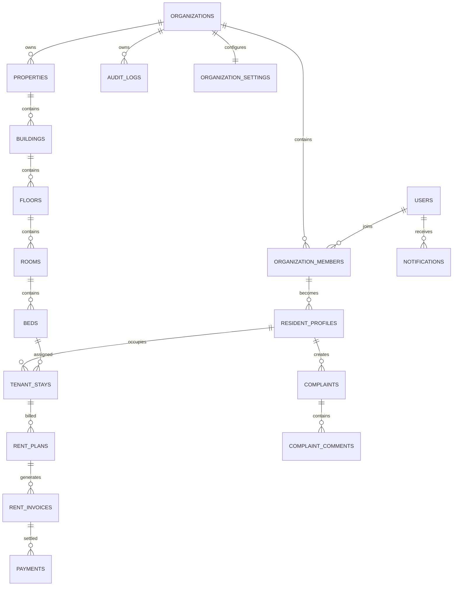

# DATABASE.md

# 1. Overview

Nestro uses PostgreSQL (Supabase) as its primary database.

The system is designed as a **multi-tenant SaaS platform** where:

- One organization can manage multiple properties
- One property can be a PG, Hostel, Apartment, Hotel, or Co-living space
- Users belong to organizations through memberships
- All business data is isolated by organization
- The FastAPI backend is the only component allowed to access the database

---

# 2. Design Principles

## Multi-Tenant First

Every business table contains:

```sql
organization_id UUID NOT NULL
```

All queries must be scoped by organization:

```sql
WHERE organization_id = :organization_id
```

No cross-organization access is permitted.

## UUID Primary Keys

All primary keys use:

```sql
UUID
```

Generated with:

```sql
gen_random_uuid()
```

## Timestamps

Every table contains:

```sql
created_at TIMESTAMPTZ
updated_at TIMESTAMPTZ
```

Stored in UTC.

## Soft Deletes

Tables containing historical business data use:

```sql
deleted_at TIMESTAMPTZ NULL
```

Records are archived rather than removed.

Examples:

- organizations
- properties
- rooms
- users

## Hard Deletes

Allowed only for:

- temporary records
- cache records
- device tokens

## Auditability

Business actions are tracked through:

```text
audit_logs
```

## File Storage

Files are stored in:

```text
Supabase Storage
```

Metadata is stored in:

```text
files
```

---

# 3. Multi-Tenant Architecture

```text
Organization
│
├── Members
│
├── Properties
│   ├── Buildings
│   │   ├── Floors
│   │   │   ├── Rooms
│   │   │   │   ├── Beds
│
│   ├── Resident Profiles
│   ├── Rent Plans
│   ├── Rent Invoices
│   ├── Payments
│   ├── Complaints
│   ├── Notices
│
│   ├── Files
│   ├── Audit Logs
│   └── Settings
│
└── Notifications
```

---

# 4. Entity Relationship Diagram



---

# 5. organizations

## Purpose

Top-level tenant boundary.

Represents a legal business entity using Nestro.

Examples:

```text
ABC Living Pvt Ltd
Elite Hostels
Green Residency
```

Each organization owns:

```text
Properties
Residents
Staff
Invoices
Complaints
Settings
```

No data is shared across organizations.

## Columns

| Column            | Type        | Notes    |
| ----------------- | ----------- | -------- |
| id                | UUID PK     |          |
| name              | TEXT        |          |
| organization_type | TEXT        |          |
| contact_email     | TEXT        | nullable |
| contact_phone     | TEXT        | nullable |
| status            | TEXT        |          |
| created_at        | TIMESTAMPTZ |          |
| updated_at        | TIMESTAMPTZ |          |
| deleted_at        | TIMESTAMPTZ | nullable |

## organization_type

```text
PG_COMPANY
HOSTEL_OPERATOR
HOTEL_GROUP
APARTMENT_MANAGER
COLIVING_OPERATOR
```

## status

```text
ACTIVE
INACTIVE
SUSPENDED
CLOSED
```

## Constraints

```sql
CHECK (
organization_type IN (
'PG_COMPANY',
'HOSTEL_OPERATOR',
'HOTEL_GROUP',
'APARTMENT_MANAGER',
'COLIVING_OPERATOR'
))
```

```sql
CHECK (
status IN (
'ACTIVE',
'INACTIVE',
'SUSPENDED',
'CLOSED'
))
```

## Indexes

```sql
idx_organizations_status
idx_organizations_name
```

---

# 6. users

## Purpose

Platform-wide user accounts.

A user can belong to multiple organizations.

Examples:

```text
Owner
Manager
Staff
Resident
Super Admin
```

Authentication is managed through:

```text
Supabase Auth
```

## Columns

| Column        | Type        |
| ------------- | ----------- |
| id            | UUID PK     |
| auth_user_id  | UUID        |
| platform_role | TEXT        |
| email         | TEXT        |
| phone         | TEXT        |
| full_name     | TEXT        |
| avatar_url    | TEXT        |
| is_active     | BOOLEAN     |
| created_at    | TIMESTAMPTZ |
| updated_at    | TIMESTAMPTZ |
| deleted_at    | TIMESTAMPTZ |

## platform_role

```text
SUPER_ADMIN
USER
```

## Constraints

```sql
UNIQUE(email)
UNIQUE(phone)
```

## Indexes

```sql
idx_users_email
idx_users_phone
```

---

# 7. organization_members

## Purpose

Connects users to organizations.

Defines permissions inside an organization.

This is the primary authorization table.

## Columns

| Column          | Type        |
| --------------- | ----------- |
| id              | UUID PK     |
| organization_id | UUID FK     |
| user_id         | UUID FK     |
| role            | TEXT        |
| joined_at       | TIMESTAMPTZ |
| created_at      | TIMESTAMPTZ |
| updated_at      | TIMESTAMPTZ |

## Roles

```text
OWNER
MANAGER
STAFF
TENANT
```

## Constraints

```sql
UNIQUE (
organization_id,
user_id
)
```

## Indexes

```sql
idx_org_member_org
idx_org_member_user
idx_org_member_role
```

---

# 8. organization_settings

## Purpose

Stores organization-specific configuration.

Example:

```json
{
  "timezone": "Asia/Kolkata",
  "currency": "INR",
  "rent_reminders": true,
  "branding": {
    "logo": "logo.png"
  }
}
```

## Columns

| Column          | Type        |
| --------------- | ----------- |
| organization_id | UUID PK FK  |
| settings        | JSONB       |
| created_at      | TIMESTAMPTZ |
| updated_at      | TIMESTAMPTZ |

---

# 9. properties

## Purpose

Physical locations managed by an organization.

Supports:

```text
PG
HOSTEL
HOTEL
APARTMENT
COLIVING
```

One organization can own many properties.

Example:

```text
ABC Living Pvt Ltd

├── PSG Boys PG
├── PSG Girls PG
├── Elite Hostel
├── Green Residency
```

## Columns

| Column          | Type        |
| --------------- | ----------- |
| id              | UUID PK     |
| organization_id | UUID FK     |
| name            | TEXT        |
| property_type   | TEXT        |
| address         | TEXT        |
| contact_phone   | TEXT        |
| rules           | TEXT        |
| status          | TEXT        |
| created_at      | TIMESTAMPTZ |
| updated_at      | TIMESTAMPTZ |
| deleted_at      | TIMESTAMPTZ |

## property_type

```text
PG
HOSTEL
HOTEL
APARTMENT
COLIVING
```

## status

```text
ACTIVE
INACTIVE
CLOSED
```

## Indexes

```sql
idx_properties_org
idx_properties_type
idx_properties_status
```

## Constraints

```sql
CHECK (
property_type IN (
'PG',
'HOSTEL',
'HOTEL',
'APARTMENT',
'COLIVING'
))
```

```sql
CHECK (
status IN (
'ACTIVE',
'INACTIVE',
'CLOSED'
))
```

---

# 10. buildings

## Purpose

Represents physical buildings within a property.

A property can have one or many buildings.

Example:

```text
PSG Boys PG

Building A
Building B
Building C
```

## Columns

| Column          | Type        |
| --------------- | ----------- |
| id              | UUID PK     |
| organization_id | UUID FK     |
| property_id     | UUID FK     |
| name            | TEXT        |
| address         | TEXT        |
| created_at      | TIMESTAMPTZ |
| updated_at      | TIMESTAMPTZ |

## Relationships

```text
Property
 └── Buildings
```

## Indexes

```sql
idx_buildings_org
idx_buildings_property
```

## Constraints

```sql
UNIQUE(property_id, name)
```

---

# 11. floors

## Purpose

Represents floors within a building.

## Columns

| Column          | Type        |
| --------------- | ----------- |
| id              | UUID PK     |
| organization_id | UUID FK     |
| building_id     | UUID FK     |
| floor_number    | INTEGER     |
| label           | TEXT        |
| created_at      | TIMESTAMPTZ |
| updated_at      | TIMESTAMPTZ |

## Example

```text
Building A

Floor 0
Floor 1
Floor 2
Floor 3
```

## Indexes

```sql
idx_floors_org
idx_floors_building
```

## Constraints

```sql
UNIQUE(building_id, floor_number)
```

---

# 12. rooms

## Purpose

Represents rentable rooms.

## Columns

| Column          | Type          |
| --------------- | ------------- |
| id              | UUID PK       |
| organization_id | UUID FK       |
| floor_id        | UUID FK       |
| room_number     | TEXT          |
| room_type       | TEXT          |
| capacity        | INTEGER       |
| default_rent    | NUMERIC(12,2) |
| status          | TEXT          |
| created_at      | TIMESTAMPTZ   |
| updated_at      | TIMESTAMPTZ   |
| deleted_at      | TIMESTAMPTZ   |

## room_type

```text
SINGLE
DOUBLE
TRIPLE
FOUR_SHARE
FIVE_SHARE
CUSTOM
```

## status

```text
AVAILABLE
PARTIAL
FULL
BLOCKED
MAINTENANCE
```

## Relationships

```text
Floor
 └── Rooms
```

## Indexes

```sql
idx_rooms_org
idx_rooms_floor
idx_rooms_status
```

## Constraints

```sql
CHECK (capacity > 0)
```

```sql
UNIQUE(floor_id, room_number)
```

---

# 13. beds

## Purpose

Represents occupancy units.

A room can contain multiple beds.

## Columns

| Column          | Type        |
| --------------- | ----------- |
| id              | UUID PK     |
| organization_id | UUID FK     |
| room_id         | UUID FK     |
| bed_code        | TEXT        |
| status          | TEXT        |
| created_at      | TIMESTAMPTZ |
| updated_at      | TIMESTAMPTZ |

## Example

```text
Room 101

Bed A
Bed B
Bed C
Bed D
```

## status

```text
AVAILABLE
OCCUPIED
BLOCKED
MAINTENANCE
```

## Indexes

```sql
idx_beds_org
idx_beds_room
idx_beds_status
```

## Constraints

```sql
UNIQUE(room_id, bed_code)
```

---

# 14. resident_profiles

## Purpose

Stores resident-specific information.

A resident must first be:

```text
User
    ↓
Organization Member
         ↓
Resident Profile
```

This avoids duplicating identity information.

## Columns

| Column                         | Type        |
| ------------------------------ | ----------- |
| id                             | UUID PK     |
| organization_id                | UUID FK     |
| organization_member_id         | UUID FK     |
| property_id                    | UUID FK     |
| emergency_contact_name         | TEXT        |
| emergency_contact_phone        | TEXT        |
| emergency_contact_relationship | TEXT        |
| occupation_type                | TEXT        |
| occupation_name                | TEXT        |
| moved_in_at                    | TIMESTAMPTZ |
| moved_out_at                   | TIMESTAMPTZ |
| is_active                      | BOOLEAN     |
| created_at                     | TIMESTAMPTZ |
| updated_at                     | TIMESTAMPTZ |

## occupation_type

```text
STUDENT
WORKING_PROFESSIONAL
BUSINESS
OTHER
```

## Indexes

```sql
idx_residents_org
idx_residents_property
idx_residents_member
idx_residents_active
```

---

# 15. tenant_stays

## Purpose

Tracks bed occupancy history.

This table is extremely important.

Never store:

```text
resident → bed
```

directly.

Use stays.

This preserves historical occupancy.

## Columns

| Column              | Type          |
| ------------------- | ------------- |
| id                  | UUID PK       |
| organization_id     | UUID FK       |
| resident_profile_id | UUID FK       |
| bed_id              | UUID FK       |
| move_in_date        | DATE          |
| move_out_date       | DATE          |
| security_deposit    | NUMERIC(12,2) |
| notes               | TEXT          |
| created_at          | TIMESTAMPTZ   |
| updated_at          | TIMESTAMPTZ   |

## Example

```text
Resident

Jan 2025 → Bed A

Jul 2025 → Bed C

Nov 2025 → Bed B
```

Full history retained.

## Constraints

Only one active stay:

```sql
One active stay per bed
One active stay per resident
```

## Indexes

```sql
idx_stays_org
idx_stays_bed
idx_stays_resident
```

---

# 16. rent_plans

## Purpose

Defines recurring billing rules.

## Columns

| Column              | Type          |
| ------------------- | ------------- |
| id                  | UUID PK       |
| organization_id     | UUID FK       |
| resident_profile_id | UUID FK       |
| amount              | NUMERIC(12,2) |
| billing_cycle       | TEXT          |
| due_day             | INTEGER       |
| deposit_amount      | NUMERIC(12,2) |
| is_active           | BOOLEAN       |
| created_at          | TIMESTAMPTZ   |
| updated_at          | TIMESTAMPTZ   |

## billing_cycle

```text
MONTHLY
QUARTERLY
HALF_YEARLY
YEARLY
```

## Constraints

```sql
CHECK (due_day BETWEEN 1 AND 31)
```

## Indexes

```sql
idx_rent_plan_org
idx_rent_plan_resident
```

---

# 17. rent_invoices

## Purpose

Generated billing records.

Each billing cycle creates one invoice.

## Columns

| Column              | Type          |
| ------------------- | ------------- |
| id                  | UUID PK       |
| organization_id     | UUID FK       |
| rent_plan_id        | UUID FK       |
| resident_profile_id | UUID FK       |
| invoice_number      | TEXT          |
| billing_start_date  | DATE          |
| billing_end_date    | DATE          |
| due_date            | DATE          |
| amount              | NUMERIC(12,2) |
| late_fee            | NUMERIC(12,2) |
| total_amount        | NUMERIC(12,2) |
| status              | TEXT          |
| created_at          | TIMESTAMPTZ   |
| updated_at          | TIMESTAMPTZ   |

## status

```text
DRAFT
ISSUED
PAID
PARTIALLY_PAID
OVERDUE
VOID
```

## Constraints

```sql
UNIQUE(invoice_number)
```

## Indexes

```sql
idx_invoice_org
idx_invoice_status
idx_invoice_due_date
idx_invoice_resident
```

---

# 18. payments

## Purpose

Stores payment transactions.

Supports:

```text
Razorpay
UPI
Cash
Bank Transfer
Card
```

## Columns

| Column                 | Type          |
| ---------------------- | ------------- |
| id                     | UUID PK       |
| organization_id        | UUID FK       |
| invoice_id             | UUID FK       |
| amount                 | NUMERIC(12,2) |
| payment_method         | TEXT          |
| gateway_transaction_id | TEXT          |
| gateway_order_id       | TEXT          |
| status                 | TEXT          |
| paid_at                | TIMESTAMPTZ   |
| created_at             | TIMESTAMPTZ   |
| updated_at             | TIMESTAMPTZ   |

## status

```text
PENDING
SUCCESS
FAILED
REFUNDED
PARTIAL_REFUND
```

## Constraints

```sql
CHECK (amount > 0)
```

## Indexes

```sql
idx_payments_org
idx_payments_invoice
idx_payments_status
idx_payments_paid_at
```

---

---

# 19. complaints

## Purpose

Allows residents to raise issues related to accommodation, facilities, maintenance, food, housekeeping, security, or other services.

## Columns

| Column                | Type        |
| --------------------- | ----------- |
| id                    | UUID PK     |
| organization_id       | UUID FK     |
| property_id           | UUID FK     |
| resident_profile_id   | UUID FK     |
| title                 | TEXT        |
| description           | TEXT        |
| category              | TEXT        |
| priority              | TEXT        |
| status                | TEXT        |
| assigned_to_member_id | UUID FK     |
| resolved_at           | TIMESTAMPTZ |
| created_at            | TIMESTAMPTZ |
| updated_at            | TIMESTAMPTZ |

## Categories

```text
MAINTENANCE
ELECTRICAL
PLUMBING
FOOD
HOUSEKEEPING
SECURITY
INTERNET
OTHER
```

## Priority

```text
LOW
MEDIUM
HIGH
URGENT
```

## Status

```text
OPEN
IN_PROGRESS
ON_HOLD
RESOLVED
CLOSED
```

## Indexes

```sql
idx_complaints_org
idx_complaints_property
idx_complaints_status
idx_complaints_priority
idx_complaints_resident
```

---

# 20. complaint_comments

## Purpose

Tracks discussion and updates related to complaints.

Allows staff and residents to communicate within a complaint thread.

## Columns

| Column       | Type        |
| ------------ | ----------- |
| id           | UUID PK     |
| complaint_id | UUID FK     |
| user_id      | UUID FK     |
| comment      | TEXT        |
| created_at   | TIMESTAMPTZ |

## Indexes

```sql
idx_complaint_comments_complaint
idx_complaint_comments_user
```

---

# 21. notices

## Purpose

Organization-wide announcements.

Examples:

```text
Rent Due Reminder
Water Shutdown Notice
Maintenance Schedule
Festival Announcement
Emergency Communication
```

## Columns

| Column          | Type         |
| --------------- | ------------ |
| id              | UUID PK      |
| organization_id | UUID FK      |
| property_id     | UUID FK NULL |
| title           | TEXT         |
| content         | TEXT         |
| published_by    | UUID FK      |
| publish_at      | TIMESTAMPTZ  |
| expires_at      | TIMESTAMPTZ  |
| created_at      | TIMESTAMPTZ  |
| updated_at      | TIMESTAMPTZ  |

## Indexes

```sql
idx_notices_org
idx_notices_property
idx_notices_publish_at
```

---

# 22. notifications

## Purpose

Stores in-app notifications delivered to users.

Examples:

```text
Rent invoice generated
Payment received
Complaint updated
New notice published
Bed allocation changed
```

## Columns

| Column            | Type        |
| ----------------- | ----------- |
| id                | UUID PK     |
| organization_id   | UUID FK     |
| user_id           | UUID FK     |
| title             | TEXT        |
| message           | TEXT        |
| notification_type | TEXT        |
| is_read           | BOOLEAN     |
| read_at           | TIMESTAMPTZ |
| created_at        | TIMESTAMPTZ |

## notification_type

```text
SYSTEM
PAYMENT
COMPLAINT
NOTICE
RENT
BOOKING
GENERAL
```

## Indexes

```sql
idx_notifications_org
idx_notifications_user
idx_notifications_read
idx_notifications_created
```

---

# 23. device_tokens

## Purpose

Stores push notification device tokens.

Used with:

```text
Firebase Cloud Messaging (FCM)
```

## Columns

| Column       | Type        |
| ------------ | ----------- |
| id           | UUID PK     |
| user_id      | UUID FK     |
| device_id    | TEXT        |
| token        | TEXT        |
| platform     | TEXT        |
| last_seen_at | TIMESTAMPTZ |
| created_at   | TIMESTAMPTZ |

## platform

```text
ANDROID
IOS
WEB
```

## Constraints

```sql
UNIQUE(token)
```

## Indexes

```sql
idx_device_tokens_user
idx_device_tokens_platform
```

---

# 24. files

## Purpose

Centralized file management.

Stores metadata for files uploaded to Supabase Storage.

Supports:

```text
Resident Documents
Property Photos
Complaint Attachments
Notice Attachments
Invoices
Reports
```

## Columns

| Column            | Type        |
| ----------------- | ----------- |
| id                | UUID PK     |
| organization_id   | UUID FK     |
| uploaded_by       | UUID FK     |
| storage_path      | TEXT        |
| original_filename | TEXT        |
| mime_type         | TEXT        |
| file_size_bytes   | BIGINT      |
| entity_type       | TEXT        |
| entity_id         | UUID        |
| created_at        | TIMESTAMPTZ |

## Example

```text
entity_type = complaint
entity_id = complaint_uuid

entity_type = resident_profile
entity_id = resident_uuid
```

## Indexes

```sql
idx_files_org
idx_files_entity
idx_files_uploaded_by
```

---

# 25. audit_logs

## Purpose

Tracks all critical actions performed in the system.

Essential for:

```text
Security
Compliance
Debugging
Dispute Resolution
Analytics
```

## Columns

| Column          | Type        |
| --------------- | ----------- |
| id              | UUID PK     |
| organization_id | UUID FK     |
| actor_user_id   | UUID FK     |
| action          | TEXT        |
| entity_type     | TEXT        |
| entity_id       | UUID        |
| metadata        | JSONB       |
| created_at      | TIMESTAMPTZ |

## Examples

```text
RESIDENT_CREATED
BED_ASSIGNED
INVOICE_GENERATED
PAYMENT_RECORDED
COMPLAINT_RESOLVED
NOTICE_PUBLISHED
USER_INVITED
```

## Indexes

```sql
idx_audit_org
idx_audit_actor
idx_audit_entity
idx_audit_created
```

---

# 26. Referential Integrity Rules

## Organization Isolation

Every business entity must belong to:

```text
organization_id
```

No entity may exist without an organization.

---

## Property Isolation

Properties belong to organizations.

Buildings belong to properties.

Floors belong to buildings.

Rooms belong to floors.

Beds belong to rooms.

---

## Resident Lifecycle

```text
User
    ↓
Organization Member
    ↓
Resident Profile
    ↓
Tenant Stay
    ↓
Rent Plan
    ↓
Rent Invoice
    ↓
Payment
```

---

## Complaint Lifecycle

```text
Resident
    ↓
Complaint
    ↓
Comments
    ↓
Resolution
```

---

# 27. Indexing Strategy

Every table containing:

```sql
organization_id
```

must have an index.

Examples:

```sql
CREATE INDEX idx_rooms_org
ON rooms(organization_id);

CREATE INDEX idx_payments_org
ON payments(organization_id);

CREATE INDEX idx_complaints_org
ON complaints(organization_id);
```

---

# 28. Multi-Tenant Query Rule

All application queries must include:

```sql
WHERE organization_id = :organization_id
```

Example:

```sql
SELECT *
FROM rooms
WHERE organization_id = :organization_id;
```

Never expose data across organizations.

---

# 29. Future Expansion Tables (Phase 2+)

These tables are intentionally excluded from MVP.

### bookings

For hotel-style reservations.

### housekeeping_tasks

For cleaning workflows.

### maintenance_requests

Advanced maintenance tracking.

### visitor_logs

Guest entry and exit management.

### inventory

Consumables and stock tracking.

### vendor_management

External service providers.

### ai_conversations

AI assistant chat history.

### marketplace_listings

Marketplace expansion.

### roommate_matching

Resident matching system.

### analytics_snapshots

Precomputed analytics data.

---

# 30. Final Architecture Summary

```text
Organization
│
├── Organization Members
│
├── Properties
│   ├── Buildings
│   │   ├── Floors
│   │   │   ├── Rooms
│   │   │   │   ├── Beds
│
│   ├── Resident Profiles
│   │   ├── Tenant Stays
│   │   ├── Rent Plans
│   │   ├── Rent Invoices
│   │   └── Payments
│
│   ├── Complaints
│   │   └── Complaint Comments
│
│   ├── Notices
│   ├── Files
│   └── Audit Logs
│
├── Notifications
├── Device Tokens
└── Organization Settings
```

This schema is designed to support:

- PGs
- Hostels
- Co-living Spaces
- Apartments
- Hotels

while maintaining strict multi-tenant isolation and production-grade scalability.
